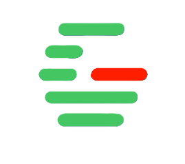

# <p align="center"> </p>Greenline 

> An open forum platform made for developers and programmers.

Greenline was built to foster learning through visual communication of code challenges and solutions. Inspired by Stack Overflow, it introduces a clean, user-friendly way to **collaborate**, **highlight code issues visually**, and **engage with a coding community**.

---

## 📌 Original Description

Greenline is an open forum for programmers/developers just like Stack Overflow.

But what makes this different is it focuses on helping others understand a code by **adding a container where the code is written and highlight specific areas in red** (which is a problem area).

This creates a **collaborative learning environment** where users can:

- Post problems with visual indicators
- Seek solutions from others in a simplified and readable format
- Learn from highlighted errors and feedback from the community

---

## 🔧 Tech Stack

| Tech            | Purpose                              |
|-----------------|--------------------------------------|
| **Next.js**     | React-based framework                |
| **TypeScript**  | Type-safe development                |
| **Tailwind CSS**| Utility-first modern styling         |
| **PostCSS**     | CSS transformation tool              |
| **ESLint**      | Code linting                         |

---

## 📁 Folder Structure

Greenline/
├── components/ # UI components like NavBar, Cards, Containers
├── public/ # Static files (images, icons, etc.)
├── src/
│ └── app/ # App router logic for all routes/pages
├── styles/ # Custom Tailwind/global styles
├── tailwind.config.ts # Tailwind theme configuration
├── tsconfig.json # TypeScript settings
├── postcss.config.mjs # PostCSS plugin config
├── next.config.ts # App-level settings (build, env)
└── README.md # This file

---

## 💻 Setup Instructions

1. **Clone the Repository**
   ```bash
   git clone https://github.com/xebec1234/Greenline.git
   cd Greenline
Install Dependencies

npm install
Run Development Server

npm run dev
Open your browser at http://localhost:3000

✨ Key Features
📝 Post a code issue with highlighted problem areas

💬 Community-based discussions per post

🎯 Clean, responsive design

🚀 Built with modern tech stack (Next.js + Tailwind)

🔐 Designed for scalability and future database integration

📤 Plan to integrate login system & user roles

📸 Preview (Mockup/GIF idea)
(Add a screenshot here for visual impact)

🧩 Coming Soon
✅ Highlighted Code Blocks

🔐 User Authentication & Sessions

💬 Comment Threads and Voting

🗂️ Categories/Tags for Code Posts

🧠 AI-based Suggested Solutions (future idea)

📦 Deployment
This project is ready for deployment on platforms like:

Vercel

Netlify

Render

To build for production:

npm run build
npm start
🧠 Contributions
Pull requests welcome! Here's how to contribute:

Fork this repo

Create your branch: git checkout -b feature/amazing-feature

Commit changes: git commit -am 'Add amazing feature'

Push to the branch: git push origin feature/amazing-feature

Create a new Pull Request

📝 License
MIT License
Feel free to fork, modify, and contribute.

🙌 Author
Created by xebec1234

“Let’s make code more understandable—together.”
